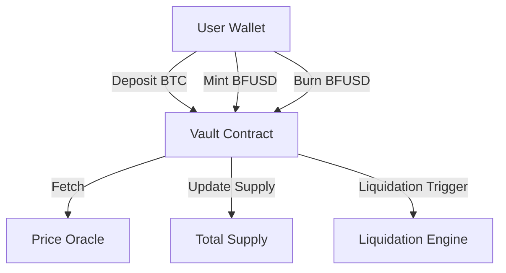

# BitForge Protocol — Bitcoin-Collateralized Stablecoin on Stacks

**BitForge** is a trustless, Bitcoin-backed stablecoin protocol built natively on the [Stacks](https://www.stacks.co/) blockchain. By leveraging Clarity smart contracts and the security of Bitcoin, BitForge enables users to mint USD-pegged stablecoins (`BFUSD`) by locking BTC as collateral through over-collateralized vaults.

This document provides a professional overview of the system’s architecture, smart contract design, and operational data flow.

---

## 🧠 System Overview

BitForge enables decentralized issuance of `BFUSD` — a stablecoin soft-pegged to the US Dollar — using Bitcoin as collateral. The system combines:

* **Collateralized Debt Position (CDP)** mechanics
* **Price oracles** for real-time BTC valuation
* **Automated liquidation** for undercollateralized vaults
* **Governance-controlled parameters** for flexibility and risk management

---

## 🔐 Key Features

* **Bitcoin-Collateralized CDPs:** Users deposit BTC to open vaults and mint `BFUSD`, preserving asset control while accessing liquidity.
* **Multi-Oracle Price Feeds:** Aggregates BTC price data from approved oracles with bounds on validity and frequency.
* **Automated Liquidations:** Vaults below threshold collateralization are trustlessly liquidated to maintain protocol solvency.
* **Dynamic Risk Controls:** Collateral ratios and fee structures are updatable by the protocol owner (DAO-ready architecture).
* **Gas-Efficient Minting & Redemption:** Minimal operations for stablecoin lifecycle, ensuring low on-chain costs.
* **Fully Permissionless Vaults:** Any user can open and manage vaults directly from their wallet.

---

## 🏗️ Contract Architecture

The BitForge protocol consists of a single Clarity contract that encapsulates the entire system logic:

### Traits

* **`sip-010-token`** — Defines standard token interface compatibility, ensuring future integration with wallets and DeFi protocols.

### Core Components

| Component                 | Description                                                       |
| ------------------------- | ----------------------------------------------------------------- |
| `vaults`                  | Mapping of CDPs containing BTC collateral and minted stablecoins. |
| `btc-price-oracles`       | Authorized oracles allowed to submit BTC/USD prices.              |
| `last-btc-price`          | Stores the most recent valid BTC price with block timestamp.      |
| `total-supply`            | Tracks total minted `BFUSD`.                                      |
| `collateralization-ratio` | Minimum ratio (e.g., 150%) to mint stablecoins.                   |
| `liquidation-threshold`   | Critical threshold (e.g., 125%) for triggering liquidation.       |
| `mint/redeem fees`        | Dynamic fee rates for issuing and burning stablecoins.            |
| `vault-counter`           | Sequential ID generator for vault creation.                       |

---

## 🔁 Functional Overview

### 1. **Vault Lifecycle**

* **Create Vault**

  * Users deposit BTC via off-chain (e.g., sBTC or atomic swap).
  * Smart contract records `collateral-amount`, initializes vault ID.

* **Mint Stablecoin**

  * On-chain BTC price is retrieved from oracle.
  * If vault maintains required collateralization, `BFUSD` is minted.

* **Redeem Stablecoin**

  * Users can repay and burn `BFUSD` to unlock BTC.
  * Fees deducted based on `redemption-fee-bps`.

* **Liquidation**

  * Anyone can liquidate vaults under the threshold.
  * Vault is deleted, and the stablecoins are burned.

---

## 🔄 Data Flow

* BTC is sent off-chain or via sBTC to vault manager (external).
* Vault contract checks price feed from oracles.
* Minting, burning, and liquidations update on-chain storage and token supply.

---

## ⚙️ Governance

The protocol includes administrative methods gated by the contract owner (`CONTRACT-OWNER`):

* **`update-collateralization-ratio`**
* **`add-btc-price-oracle`**
* **Fee adjustments and protocol upgrades (planned)**

> Future iterations may integrate DAO governance to decentralize parameter control.

---

## 🔍 Read-Only Functions

| Function               | Description                                 |
| ---------------------- | ------------------------------------------- |
| `get-latest-btc-price` | Returns current BTC/USD price if available. |
| `get-vault-details`    | Fetch vault data for given owner and ID.    |
| `get-total-supply`     | Returns current supply of `BFUSD`.          |

---

## 🛡️ Security & Validation

* All inputs validated for correctness and authorization.
* Vault actions are strictly owner-only.
* Liquidation guarded by oracle-provided real-time prices.
* Bounded BTC price and timestamp to avoid overflow/exploit vectors.

---

## 📦 Deployment Notes

* Built using Clarity for Stacks 2.1.
* Designed for compatibility with sBTC or trusted BTC bridges (off-chain BTC custody not handled here).
* Requires oracle integration for price feed (Chainlink, Hiro, or custom federated set).

---

## ✅ TODO & Future Extensions

* **sBTC Integration:** Direct BTC locking using native BTC-backed assets on Stacks.
* **DAO Governance:** Parameter management by token-holder voting.
* **Stability Module:** PSM-like mechanism to enable 1:1 redemption using treasury BTC.
* **Multi-Collateral Support:** Expansion to other assets (e.g., STX, xUSD).

---

## 📄 License

MIT © 2025 BitForge Contributors
